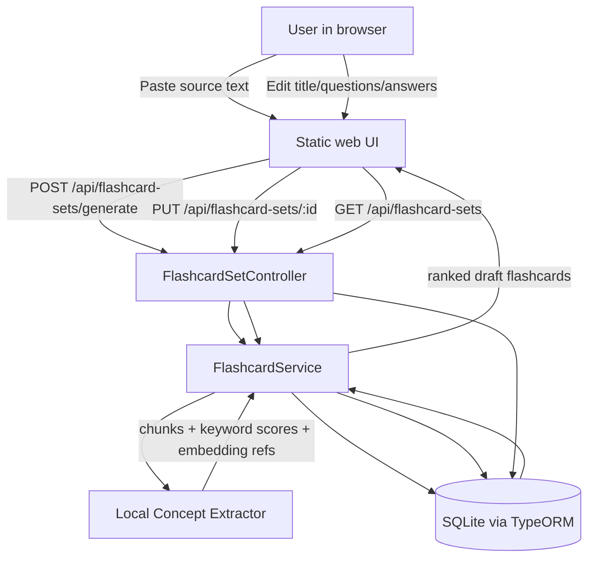

# ClueCrop

A tiny NestJS web app that turns pasted notes, articles, or meeting transcripts into a ranked, editable set of study flashcards.

This MVP runs fully locally. It does **not** require an LLM or external embedding provider; it uses a deterministic local keyword/TF-style extractor plus lightweight hashed vector references to identify reusable concepts and produce concise Q/A pairs.

## Architecture



## Requirements

- Node.js 18+
- npm

## Run locally

```bash
npm install
npm run start:dev
```

Then open:

```text
http://localhost:3000
```

## One-command Docker option

```bash
docker compose up --build
```

Then open `http://localhost:3000`.

## Environment variables

Copy `.env.example` to `.env` if you want to customize settings.

| Variable | Default | Description |
| --- | --- | --- |
| `PORT` | `3000` | HTTP port for the NestJS app |
| `DATABASE_PATH` | `./data/cluecrop.sqlite` | SQLite database file path |

## Core workflow

1. Paste messy notes or a transcript into the text area.
2. Click **Generate flashcards**.
3. ClueCrop chunks and ranks the text, generates concise Q/A flashcards, and saves a flashcard set.
4. Edit the title, questions, and answers inline.
5. Click **Save edits**.
6. Reopen saved sets from the sidebar.

## API

- `GET /api/flashcard-sets` - list saved flashcard sets
- `GET /api/flashcard-sets/:id` - get one set with cards and chunks
- `POST /api/flashcard-sets/generate` - create a set and generated cards from pasted text
- `PUT /api/flashcard-sets/:id` - update title and edited cards
- `DELETE /api/flashcard-sets/:id` - delete a set

## Notes on the local extraction approach

The MVP approximates embeddings with normalized hashed term vectors stored as `SourceChunk.embeddingRef`. Reusable concepts are ranked using repeated significant terms, sentence clarity, and chunk length. This keeps the app private, fast, and runnable without external services while preserving the data model needed to swap in real embeddings later.
